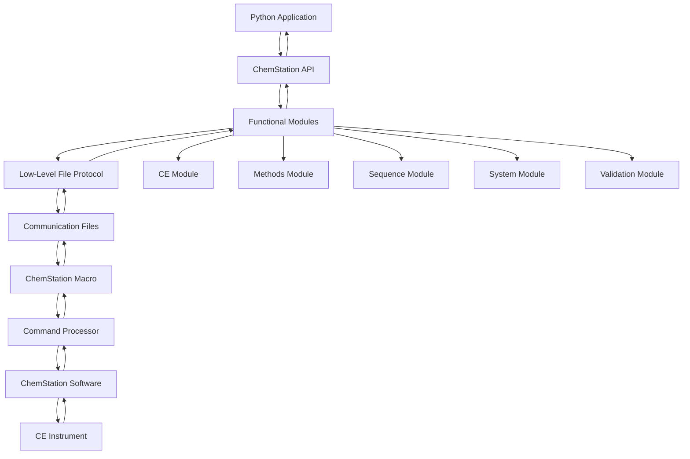

# ChemStation API Introduction

## What is the ChemStation API?

The ChemStation API provides a Python interface for controlling Agilent ChemStation software and CE instruments. It enables automated control of capillary electrophoresis systems without manual intervention.

The API works by sending commands directly to ChemStation's Command Processor (CP) through a specialized communication protocol. Commands are sent from Python to ChemStation's command line interface, enabling direct control of all ChemStation functionality. This is achieved through a special macro system that monitors for Python commands and executes them within ChemStation - more details about this communication protocol can be found on the [File-Based Protocol](file-protocol.md) page.

The API provides pre-built commands and methods for common operations, making it easy to automate complex analytical workflows. While these commands work with current ChemStation versions, please note that compatibility with newer OpenLAB CDS 2.x versions may be limited.

The system is specifically optimized for capillary electrophoresis applications, but can be easily adapted for any instrument controlled by ChemStation software.

## Key Capabilities

### Instrument Control (CE)
- Load and unload vials from carousel to analysis positions
- Monitor vial positions and system states
- Apply pressure to capillary (pressure application and flushing)
- Real-time system monitoring

### Method Management
- Load existing methods
- Save methods with modifications
- Run methods with sample-specific information
- Progress monitoring and control

### Sequence Operations
- Load and save sequences
- Modify sequence tables
- Import sequence tables from Excel
- Control sequence execution (start/pause/resume)

### System Monitoring
- Real-time status monitoring
- Analysis progress tracking
- Error detection and handling
- System readiness validation

### Validation
- Validate method and sequence file existence
- Check carousel occupancy and vial presence
- Verify system readiness for operations
- Pre-flight checks for automated workflows

## Architecture Overview



## How It Works

The communication flow works as follows:

1. **Python Command**: A command is sent from Python through one of the API modules
2. **Module Processing**: The specific module (CE, Methods, Sequence, etc.) formats the command for ChemStation
3. **Low-Level API**: The command is passed to the file-based communication protocol
4. **File Writing**: The command is written to a communication file with a unique number
5. **Macro Monitoring**: A ChemStation macro continuously monitors the communication file
6. **Command Execution**: The macro sends the command to ChemStation's Command Processor
7. **Response Generation**: ChemStation executes the command and generates a response
8. **Response Writing**: The response is written back to a response file
9. **Response Reading**: The low-level API reads the response from the file
10. **Return to Python**: The response is passed back through the modules to the Python application

This bidirectional communication enables full control of ChemStation from Python while maintaining reliability and error handling.

## Core Components

### ChemstationAPI Class
The main entry point providing access to all modules:

```python
from ChemstationAPI import ChemstationAPI

api = ChemstationAPI()
```

### Modules

**CE Module** (`api.ce`)
- Vial handling operations
- Capillary conditioning
- Pressure control

**Methods Module** (`api.method`)
- Method loading and saving
- Method execution
- Parameter modification

**Sequence Module** (`api.sequence`)
- Sequence table management
- Excel integration
- Batch execution control

**System Module** (`api.system`)
- Status monitoring
- Progress tracking
- System control

**Validation Module** (`api.validation`)
- Pre-operation checks
- File existence validation
- System state verification

## Typical Workflow

```python
# 1. Initialize connection
api = ChemstationAPI()

# 2. Validate prerequisites
api.validation.validate_vial_in_system(15)
api.validation.validate_method_name("CE_Analysis")

# 3. Prepare instrument
api.ce.load_vial_to_position(15, "inlet")
api.ce.load_vial_to_position(48, "outlet")

# 4. Condition capillary
api.ce.flush_capillary(60.0)

# 5. Run analysis
api.method.execution_method_with_parameters(
    vial=15,
    method_name="CE_Analysis",
    sample_name="Sample_001"
)

# 6. Monitor progress
while api.system.method_on():
    remaining = api.system.get_remaining_analysis_time()
    print(f"Time remaining: {remaining:.1f} minutes")
```

## Benefits

### Automation
- Eliminate manual operations
- Process large sample batches
- Reduce human error

### Reproducibility
- Consistent method execution
- Standardized workflows
- Traceable operations

### Integration
- Connect with other systems (pumps, SIA, etc.)
- Implement custom workflows
- Create adaptive methods

### Efficiency
- Parallel sample preparation
- Reduced analysis time
- Increased throughput

!!! tip "Next Steps"
    Learn about the [File-Based Protocol](file-protocol.md) that enables communication with ChemStation.