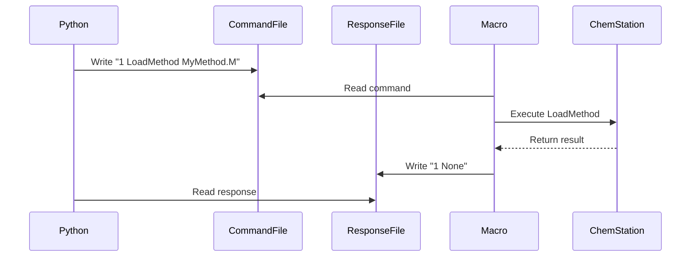

# File-Based Communication Protocol

Understanding how Python communicates with ChemStation is crucial for troubleshooting and advanced usage. This page explains the file-based protocol that enables reliable command execution.

## Protocol Overview

The SIA-CE package communicates with ChemStation through a file-based protocol rather than direct API calls. This approach provides several advantages:

- ✅ **Reliability**: File operations are atomic and less prone to corruption
- ✅ **Debugging**: Commands and responses can be monitored in real-time
- ✅ **Compatibility**: Works across different ChemStation versions
- ✅ **Asynchronous**: Python and ChemStation run independently

## How It Works

### Communication Flow



### Key Components

1. **Command File** (`communication_files/command`)
   - Python writes numbered commands
   - Format: `<command_number> <command_string>`
   - Example: `42 response$ = _METHPATH$`

2. **Response File** (`communication_files/response`)
   - ChemStation writes numbered responses
   - Format: `<command_number> <response_string>`
   - Example: `42 C:\Chem32\1\Methods\`

3. **ChemStation Macro** (`ChemPyConnect.mac`)
   - Monitors command file continuously
   - Executes commands via ChemStation Command Processor
   - Writes responses back

4. **Python Communicator** (`chemstation_communication.py`)
   - Manages command numbering
   - Handles timeouts and retries
   - Parses responses

## Command Format

### Basic Commands

Commands without return values:

```python
# Python code
api.send("LoadMethod _METHPATH$, MyMethod.M")

# Command file content
123 LoadMethod _METHPATH$, MyMethod.M

# Response file content
123 None
```

### Commands with Return Values

To capture a return value, prefix with `response$ = `:

```python
# Python code
path = api.send("response$ = _METHPATH$")

# Command file content
124 response$ = _METHPATH$

# Response file content
124 C:\Chem32\1\Methods\CE\
```

### Module Commands

Sending commands to instrument modules:

```python
# Python code
api.send('WriteModule "CE1", "FLSH 60.0,-2,-2"')

# Command file content
125 WriteModule "CE1", "FLSH 60.0,-2,-2"

# Response file content
125 None
```

## Command Numbering

The protocol uses sequential command numbers to match responses with requests:

- Numbers increment from 1 to 256 (configurable)
- Automatically wraps around at maximum
- Ensures each command gets its correct response
- Prevents mixing responses from multiple commands

```python
# Example of command numbering in action
1 response$ = _METHPATH$
2 LoadMethod _METHPATH$, Test.M
3 response$ = VAL$(_MethodOn)
...
256 response$ = ACQSTATUS$
1 response$ = _DATAPATH$  # Wraps around
```

## File Locations

Default file locations:

```
SIA-CE/
└── ChemstationAPI/
    └── core/
        ├── ChemPyConnect.mac          # Macro file
        └── communication_files/       # Communication directory
            ├── command               # Command file
            └── response              # Response file
```

## Monitoring Communication

### Enable Verbose Mode

```python
from ChemstationAPI.core.communication_config import CommunicationConfig

config = CommunicationConfig(verbose=True)
api = ChemstationAPI(config)

# Now all commands and responses are printed
api.send("response$ = _METHPATH$")
# Output:
# Sending command 1: response$ = _METHPATH$
# Received response 1: C:\Chem32\1\Methods\CE\
```

### Manual File Monitoring

You can monitor files directly during debugging:

```bash
# Windows PowerShell - Monitor command file
Get-Content -Path "communication_files\command" -Wait

# Windows PowerShell - Monitor response file  
Get-Content -Path "communication_files\response" -Wait
```

## Error Handling

### Timeout Handling

```python
# Increase timeout for long operations
api.send("RunMethod _DATAPATH$,, Sample001", timeout=30.0)
```

### Error Responses

ChemStation errors are detected and raised as exceptions:

```python
try:
    api.send("InvalidCommand")
except ChemstationError as e:
    print(f"Error: {e}")
    # Output: Error: ChemStation command failed: ERROR: The command InvalidCommand failed to execute
```

## Macro Initialization

The ChemStation macro must be running for communication to work:

```vb
' ChemStation command line
macro "C:\path\to\ChemPyConnect.mac"; Python_Run
```

The macro runs in a continuous loop:
1. Reads command file every 200ms
2. Executes new commands (higher number than last)
3. Writes responses
4. Continues until "Exit" command

## Advanced Configuration

### Custom Configuration

```python
from ChemstationAPI.core.communication_config import CommunicationConfig

config = CommunicationConfig(
    comm_dir="custom/path",
    max_command_number=1000,
    retry_delay=0.2,
    max_retries=5,
    default_timeout=10.0
)

api = ChemstationAPI(config)
```

### Configuration Options

| Parameter | Default | Description |
|-----------|---------|-------------|
| `comm_dir` | `"core/communication_files"` | Communication directory |
| `max_command_number` | `256` | Maximum before wraparound |
| `retry_delay` | `0.1` | Seconds between retries |
| `max_retries` | `10` | Maximum retry attempts |
| `default_timeout` | `5.0` | Default command timeout |
| `verbose` | `False` | Enable debug output |

## Troubleshooting Protocol Issues

### No Response Received

**Symptoms**: TimeoutError after sending command

**Check**:
1. Is ChemStation macro running?
2. Are file paths correct?
3. Can Python write to communication directory?

### Wrong Response Received

**Symptoms**: Response doesn't match command

**Check**:
1. Command numbering synchronization
2. Multiple Python instances running?
3. Old responses in response file?

### Slow Communication

**Symptoms**: Commands take long to execute

**Solutions**:
1. Reduce retry_delay in configuration
2. Check disk performance
3. Ensure antivirus isn't scanning communication files

## Best Practices

1. **Always Start Fresh**
   - Delete old command/response files before starting
   - Macro automatically creates new files

2. **Use Appropriate Timeouts**
   - Short operations: 5-10 seconds
   - Method execution: 30+ seconds
   - File operations: 10-15 seconds

3. **Handle Errors Gracefully**
   ```python
   try:
       result = api.send("response$ = _METHPATH$")
   except TimeoutError:
       print("ChemStation not responding")
   except ChemstationError as e:
       print(f"Command failed: {e}")
   ```

4. **Monitor During Development**
   - Enable verbose mode
   - Watch communication files
   - Check ChemStation command line for errors

!!! tip "Understanding the Protocol"
    The file-based protocol might seem complex, but it's very reliable once properly configured. Most issues come from macro not running or incorrect file paths.