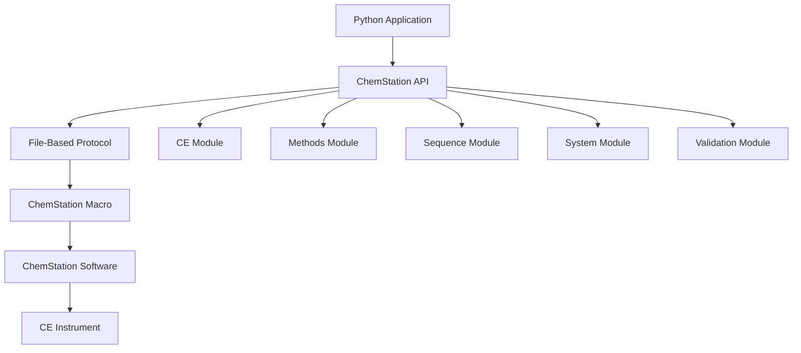

# ChemStation API Introduction

## What is the ChemStation API?

The ChemStation API provides a Python interface for controlling Agilent ChemStation software and CE instruments. It enables automated control of capillary electrophoresis systems without manual intervention.

## Key Capabilities

### Instrument Control
- Load and unload vials from carousel to analysis positions
- Control capillary conditioning and flushing
- Apply pressure for sample injection
- Monitor vial positions and system state

### Method Management
- Load existing CE methods
- Execute methods with custom parameters
- Save modified methods
- Run methods with sample-specific information

### Sequence Operations
- Create and modify sequence tables
- Import sequences from Excel
- Execute batch analyses
- Control sequence execution (start/pause/resume)

### System Monitoring
- Real-time status monitoring
- Analysis progress tracking
- Error detection and handling
- System readiness validation

## Architecture Overview



## How It Works

1. **Communication Layer**: Uses file-based protocol for reliable command exchange
2. **Module Organization**: Functionality divided into logical modules
3. **Command Processing**: Commands sent to ChemStation's Command Processor
4. **Response Handling**: Automatic response parsing and error detection
5. **State Management**: Tracks instrument and analysis states

## Core Components

### ChemstationAPI Class
The main entry point providing access to all modules:

```python
from ChemstationAPI import ChemstationAPI

api = ChemstationAPI()
```

### Modules

**CE Module** (`api.ce`)
- Vial handling operations
- Capillary conditioning
- Pressure control

**Methods Module** (`api.method`)
- Method loading and saving
- Method execution
- Parameter modification

**Sequence Module** (`api.sequence`)
- Sequence table management
- Excel integration
- Batch execution control

**System Module** (`api.system`)
- Status monitoring
- Progress tracking
- System control

**Validation Module** (`api.validation`)
- Pre-operation checks
- File existence validation
- System state verification

## Typical Workflow

```python
# 1. Initialize connection
api = ChemstationAPI()

# 2. Validate prerequisites
api.validation.validate_vial_in_system(15)
api.validation.validate_method_name("CE_Analysis")

# 3. Prepare instrument
api.ce.load_vial_to_position(15, "inlet")
api.ce.load_vial_to_position(48, "outlet")

# 4. Condition capillary
api.ce.flush_capillary(60.0)

# 5. Run analysis
api.method.execution_method_with_parameters(
    vial=15,
    method_name="CE_Analysis",
    sample_name="Sample_001"
)

# 6. Monitor progress
while api.system.method_on():
    remaining = api.system.get_remaining_analysis_time()
    print(f"Time remaining: {remaining:.1f} minutes")
```

## Benefits

### Automation
- Eliminate manual operations
- Run overnight analyses
- Process large sample batches
- Reduce human error

### Reproducibility
- Consistent method execution
- Standardized workflows
- Traceable operations
- Documented parameters

### Integration
- Connect with LIMS systems
- Implement custom workflows
- Add decision logic
- Create adaptive methods

### Efficiency
- Parallel sample preparation
- Optimized sequences
- Reduced analysis time
- Increased throughput

## Requirements

### Software
- Agilent ChemStation software
- Windows operating system
- Python 3.7 or higher

### Hardware
- Agilent 7100 CE System (or compatible)
- Properly configured instrument
- Communication connection

### Setup
- ChemStation macro must be running
- Communication files accessible
- Proper permissions configured

## Getting Started

1. **Install the package**
   ```bash
   pip install sia-ce
   ```

2. **Start ChemStation macro**
   ```
   In ChemStation command line:
   macro "path\to\ChemPyConnect.mac"; Python_Run
   ```

3. **Test connection**
   ```python
   from ChemstationAPI import ChemstationAPI
   api = ChemstationAPI()
   print("Connected successfully!")
   ```

## Design Philosophy

The ChemStation API is designed with these principles:

1. **Modular**: Separate modules for different functionality
2. **Robust**: Comprehensive error handling and validation
3. **Intuitive**: Methods mirror manual operations
4. **Flexible**: Support for custom workflows
5. **Reliable**: File-based protocol ensures command delivery

## Common Use Cases

### Routine Analysis
Automate daily QC samples with consistent parameters

### Method Development
Test multiple conditions programmatically

### High-Throughput Screening
Process hundreds of samples unattended

### Stability Studies
Time-point analyses with automatic scheduling

### Custom Workflows
Integrate with other laboratory systems

!!! tip "Next Steps"
    Learn about the [File-Based Protocol](file-protocol.md) that enables communication with ChemStation.