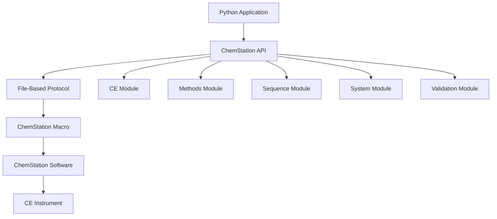

# ChemStation API Introduction

## What is the ChemStation API?

The ChemStation API provides a Python interface for controlling Agilent ChemStation software and CE instruments. It enables automated control of capillary electrophoresis systems without manual intervention.

Nějak tady popiš že to fungujhe tak, že se odesílají příkazy do chmstation comanline (command processor). Por snadnější používání, jsou již předněpřivané příkazy. Není to jen čistě por CE ale je to vyvýjeno na CE a mnho příkazů je tomu uspůsobeno. Por fungování je potřeba mít zaplý chemstation se spesiálním makrem (viz další kapitola)

## Key Capabilities

### Instrument Control (CE)
- Load and unload vials from carousel to analysis positions
- Control capillary conditioning and flushing
- Apply pressure for sample injection
- Monitor vial positions and system state

### Method Management
- Load existin methods
- Run methods with sample-specific information
- ještě něco

### Sequence Operations
- Load and save sequence
- Modify sequence tables
- Import sequence tables from Excel
- Control sequence execution (start/pause/resume)

### System Monitoring
- Real-time status monitoring
- Analysis progress tracking
- Error detection and handling
- System readiness validation

## Architecture Overview

Tady to není úplně přesné, na začátkuje python, pak je api, potí jsou mody, které následně jsou do filebase protokolu (low lelw api), které zapisuje do souborů a pak to jde do makra ale jde to tam obou straně, pak se odpovědi vraz zpět



## How It Works

Funguje to tak, že se zadá pošle příkaz z pythonu, v daném modulu je přímo příkaz pro chemstation, tkerý se odešle přes lowlevel api do souboru a přes makro v chemstationu do command processoru, pošle se odpoved do soubru, který low level api přetě a odešle zpět do pythonu. Nějak tak

1. **Communication Layer**: Uses file-based protocol for reliable command exchange
2. **Module Organization**: Functionality divided into logical modules
3. **Command Processing**: Commands sent to ChemStation's Command Processor
4. **Response Handling**: Automatic response parsing and error detection
5. **State Management**: Tracks instrument and analysis states

## Core Components

### ChemstationAPI Class
The main entry point providing access to all modules:

```python
from ChemstationAPI import ChemstationAPI

api = ChemstationAPI()
```

### Modules

**CE Module** (`api.ce`)
- Vial handling operations
- Capillary conditioning
- Pressure control

**Methods Module** (`api.method`)
- Method loading and saving
- Method execution
- Parameter modification

**Sequence Module** (`api.sequence`)
- Sequence table management
- Excel integration
- Batch execution control

**System Module** (`api.system`)
- Status monitoring
- Progress tracking
- System control

**Validation Module** (`api.validation`)
- Pre-operation checks
- File existence validation
- System state verification

## Typical Workflow

```python
# 1. Initialize connection
api = ChemstationAPI()

# 2. Validate prerequisites
api.validation.validate_vial_in_system(15)
api.validation.validate_method_name("CE_Analysis")

# 3. Prepare instrument
api.ce.load_vial_to_position(15, "inlet")
api.ce.load_vial_to_position(48, "outlet")

# 4. Condition capillary
api.ce.flush_capillary(60.0)

# 5. Run analysis
api.method.execution_method_with_parameters(
    vial=15,
    method_name="CE_Analysis",
    sample_name="Sample_001"
)

# 6. Monitor progress
while api.system.method_on():
    remaining = api.system.get_remaining_analysis_time()
    print(f"Time remaining: {remaining:.1f} minutes")
```

## Benefits

### Automation
- Eliminate manual operations
- Process large sample batches
- Reduce human error

### Reproducibility
- Consistent method execution
- Standardized workflows
- Traceable operations

### Integration
- Connect other systems (pumps, SIA, ...)
- Implement custom workflows
- Create adaptive methods

### Efficiency
- Parallel sample preparation
- Reduced analysis time
- Increased throughput

!!! tip "Next Steps"
    Learn about the [File-Based Protocol](file-protocol.md) that enables communication with ChemStation.