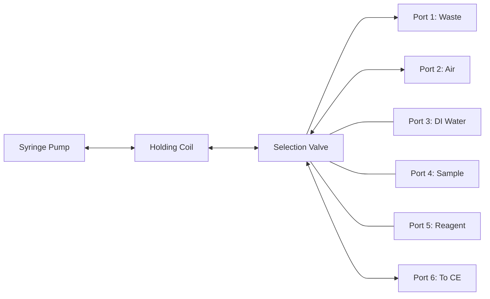

# SI API Introduction

This SI implementation is based on concepts from the CoCoSoft framework developed for analytical automation ([Horstkotte et al., 2015](https://link.springer.com/article/10.1007/s00216-015-8834-8)).

## What is Sequential Injection (SI)?

Sequential Injection is an automated liquid handling technique that provides:

- **Precise volume control** - Accurate aspiration and dispensing of exact volumes
- **Automated sample preparation** - Dilution, mixing, reagent addition
- **Minimal reagent consumption** - Microliter-scale operations
- **High reproducibility** - Computer-controlled operations eliminate manual errors

Sequential Injection is an automated liquid handling technique that enables precise sample preparation before analysis by other analytical instruments.

## SI System Components

### 1. Syringe Pump
The precision liquid handling device with bidirectional operation:

- **Variable volumes**: 100-5000 µL capacity
- **High resolution**: Stepper motor provides precise control (e.g., 0.33 µL resolution for 1000 µL syringe)
- **Bidirectional flow**: Both aspiration and dispensing operations

### 2. Multi-Position Valve
Selector valve that routes fluids between different lines:

- **Multiple positions**: Typically 6, 8, 10, or 12 ports
- **Low dead volume**: Minimizes sample carryover
- **Fast switching**: Computer-controlled position changes

### 3. Holding Coil
Critical component connecting syringe and valve:

- **Purpose**: Tube between syringe and valve preventing contamination of syringe with fluids from valve ports
- **Function**: Contains carrier medium that transfers force from syringe to valve without direct fluid contact
- **Typical volume**: 500-2000 µL

### 4. Flow Lines
Connection tubing that links valve ports to:

- Sample containers and reagent reservoirs  
- Waste collection and air supply
- Analytical instruments (CE, HPLC, etc.)
- Various buffers and cleaning solutions

Small air bubbles can be used to separate different liquids within the holding coil and transfer lines, preventing unwanted mixing of solutions.

## How SI Works



**Flow Direction Legend:**
- **Dispense only**: Waste, To CE (outbound flow)
- **Aspirate only**: Air, Reagents, DI water (inbound flow)
- **Bidirectional**: Samples (can be aspirated and returned)

### Basic Operation Principles

**Simple Transfer Process:**
1. Valve selects source port (e.g., reagent reservoir)
2. Syringe aspirates desired volume 
3. Valve switches to destination port (e.g., sample vial)
4. Syringe dispenses the volume

**Fluid Isolation:**
Air bubbles can separate different liquids to prevent cross-contamination during complex operations.

### Holding Coil Function

The holding coil serves as an intermediary between the syringe and valve:

```
[Syringe] ← [Pushing Liquid] ← [Air Bubble] ← [Sample/Reagent] ← [Valve Port]
```

- **Pushing liquid** (typically air or inert solution) remains in holding coil
- **Air bubble** separates pushing liquid from aspirated fluid
- **Sample/reagent** flows from valve port without contaminating syringe

## Key Advantages

### Contamination Prevention
- Holding coil prevents sample-to-syringe contamination
- Air bubbles separate incompatible solutions
- Easy cleaning protocols between different samples

### Precision and Reproducibility
- Computer-controlled volumes (±0.1% accuracy)
- Consistent flow rates and timing
- Eliminates manual pipetting errors

### Automation Capability
- Unattended operation for multiple samples
- Integration with analytical instruments
- Programmable sequences for complex preparations

## When to Use SI

SI is ideal for:

✅ **Sample preparation** - Serial dilutions, matrix matching, buffer exchange  
✅ **Reagent addition** - Internal standards, derivatization, precipitation  
✅ **Sample introduction** - Controlled injection, sample stacking  
✅ **System maintenance** - Automated cleaning, line conditioning