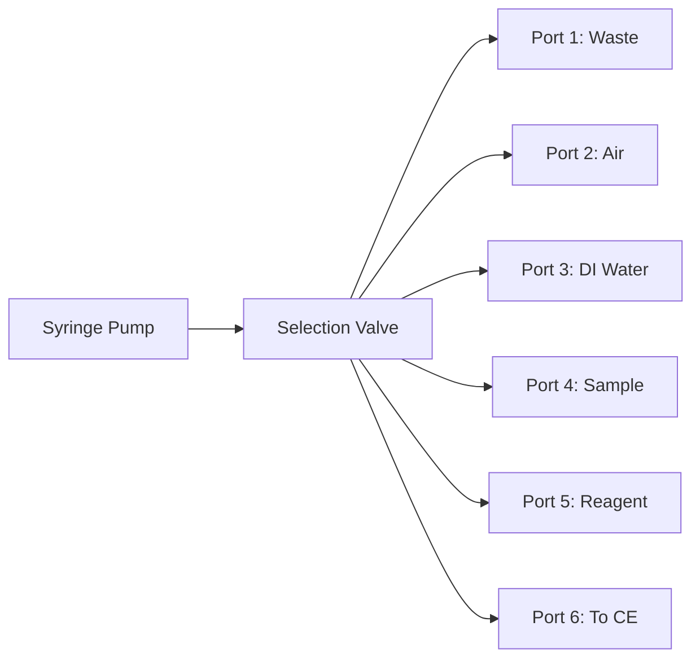

# SIA API Introduction

## What is Sequential Injection Analysis?

Sequential Injection Analysis (SIA) is an automated liquid handling technique that enables:

- **Precise volume control** - Aspirate and dispense exact volumes
- **Automated sample preparation** - Dilution, mixing, reagent addition
- **Reduced reagent consumption** - Microliter-scale operations
- **High reproducibility** - Computer-controlled operations

## SIA System Components

### 1. Syringe Pump
- Provides precise fluid movement
- Typical sizes: 100-5000 µL
- Bidirectional flow control
- Variable speed operation

### 2. Multi-Position Valve
- Selects between different fluid lines
- Common configurations: 6, 8, 10 positions
- Low dead volume
- Fast switching

### 3. Holding Coil
- Temporary storage for fluids
- Enables complex fluid manipulations
- Typical volume: 1-5 mL

### 4. Flow Lines
- Connect valve ports to:
  - Sample containers
  - Reagent reservoirs
  - Waste
  - Analytical instruments

## How SIA Works



Basic operation sequence:
1. Valve selects source port
2. Syringe aspirates fluid
3. Valve switches to destination
4. Syringe dispenses fluid

## SIA API Architecture

The SIA API provides three levels of control:

### 1. Low Level - Direct Device Control
```python
# Direct syringe commands
syringe.aspirate(500)
syringe.dispense(250)

# Direct valve commands
valve.position(3)
```

### 2. Mid Level - Coordinated Operations
```python
# Combined syringe and valve operations
valve.position(water_port)
syringe.aspirate(1000)
valve.position(output_port)
syringe.dispense(1000)
```

### 3. High Level - Complete Workflows
```python
# Pre-built analytical workflows
workflow.continuous_fill(vial=15, volume=1500, solvent_port=5)
workflow.homogenize_sample(vial=15, speed=1000, time=30)
```

## Key Features

### Volume Tracking
The API automatically tracks fluid volumes to prevent overflow:

```python
syringe = SyringeController(port="COM3", syringe_size=1000)
syringe.aspirate(600)  # Volume counter: 600 µL
syringe.dispense(200)  # Volume counter: 400 µL
syringe.aspirate(700)  # Error! Would exceed 1000 µL capacity
```

### Safety Features
- Automatic volume validation
- Position limits checking
- Serial communication error handling
- Graceful error recovery

### Flexible Configuration
- Customizable port assignments
- Variable flow rates
- Configurable delays and timing
- Modular workflow components

## Supported Hardware

### Syringe Pumps
- Hamilton MVP series
- Cavro XLP/XP pumps
- Other pumps with compatible command set

### Valve Selectors
- VICI Valco selectors
- Rheodyne selectors
- Compatible multi-position valves

### Communication
- RS-232 serial interface
- USB-to-serial adapters
- Standard baud rates (9600, 19200)

## When to Use SIA

SIA is ideal for:

✅ **Automated sample preparation**
- Dilution series
- Standard additions
- Matrix matching
- Sample cleanup

✅ **Reagent addition**
- Derivatization
- pH adjustment
- Internal standard addition
- Chemical reactions

✅ **Sample introduction**
- Controlled injection volumes
- Sample stacking
- Zone focusing
- Multi-segment injection

✅ **System maintenance**
- Automated cleaning
- Conditioning procedures
- Waste management
- System priming

## Integration with CE

SIA enhances CE analysis by:

1. **Sample Preparation**
   - Automated dilution to analytical range
   - Buffer matching
   - Protein precipitation
   - Filtration

2. **Standardization**
   - Internal standard addition
   - Automated calibration curves
   - Quality control samples

3. **Productivity**
   - Unattended operation
   - Overnight sample preparation
   - Reduced manual handling

4. **Precision**
   - Exact volume delivery
   - Reproducible mixing
   - Controlled timing

## Basic Concepts

### Flow Profiles
Different operations require different flow characteristics:

- **Fast transfer**: 3000-5000 µL/min
- **Precise dispensing**: 500-2000 µL/min  
- **Gentle mixing**: 100-1000 µL/min
- **Critical operations**: 50-500 µL/min

### Bubble Segmentation
Air segments prevent mixing between zones:

```python
# Aspirate sequence with air segments
valve.position(air_port)
syringe.aspirate(20)    # Air bubble
valve.position(sample_port)
syringe.aspirate(100)   # Sample zone
valve.position(air_port)
syringe.aspirate(20)    # Air bubble
```

### Continuous vs Batch Flow

**Continuous Flow**
- Transfer line filled with liquid
- Fast sequential dispensing
- Same solvent for multiple vials

**Batch Flow**
- Transfer line filled with air
- Each dispensing is independent
- Easy solvent changeover

## Getting Started

1. **Initialize Devices**
   ```python
   syringe = SyringeController(port="COM3", syringe_size=1000)
   valve = ValveSelector(port="COM4", num_positions=8)
   ```

2. **Test Communication**
   ```python
   syringe.initialize()
   valve.position(1)
   ```

3. **Create Workflow**
   ```python
   workflow = PreparedSIAMethods(ce_api, syringe, valve)
   ```

4. **Run Operations**
   ```python
   workflow.system_initialization_and_cleaning()
   ```

!!! tip "Next Steps"
    Learn about [Basic SIA Operations](basic-operations.md) to start controlling your system.