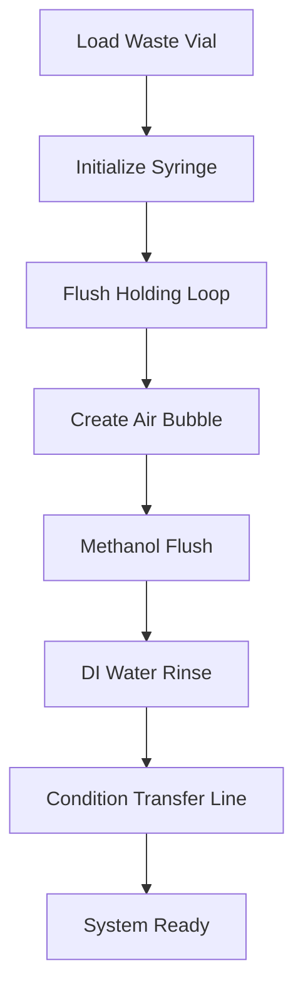

# SIA Workflows

Pre-built workflows provide high-level automation for common analytical procedures. These workflows combine syringe, valve, and CE operations into complete analytical methods.

## Workflow System Overview

The `PreparedSIAMethods` class provides:

- System initialization and cleaning
- Continuous flow filling (same solvent, multiple vials)
- Batch flow filling (different solvents, air-driven)
- Sample homogenization
- Automated needle cleaning

## Setting Up Workflows

### Basic Setup

```python
from ChemstationAPI import ChemstationAPI
from SIA_API.devices import SyringeController, ValveSelector
from SIA_API.methods import PreparedSIAMethods

# Initialize all components
ce_api = ChemstationAPI()
syringe = SyringeController(port="COM3", syringe_size=1000)
valve = ValveSelector(port="COM4", num_positions=8)

# Create workflow controller
workflow = PreparedSIAMethods(
    chemstation_controller=ce_api,
    syringe_device=syringe,
    valve_device=valve
)
```

### Custom Port Configuration

```python
from SIA_API.methods import create_custom_config

# Create custom port mapping
custom_ports = create_custom_config(
    waste_port=8,      # Changed from default 1
    air_port=1,        # Changed from default 2
    di_port=2,         # Changed from default 3
    transfer_port=7,   # Changed from default 4
    meoh_port=6        # Changed from default 5
)

# Use custom configuration
workflow = PreparedSIAMethods(
    chemstation_controller=ce_api,
    syringe_device=syringe,
    valve_device=valve,
    ports_config=custom_ports
)
```

## System Initialization

### Complete System Preparation

```python
# Initialize and clean entire system
workflow.system_initialization_and_cleaning(
    waste_vial=50,      # Vial for waste collection
    bubble=20           # Size of separating bubble (µL)
)
```

This method performs:
1. Syringe initialization to home position
2. Speed setting to default values
3. Loop flushing with air
4. Methanol cleaning cycle
5. DI water rinsing
6. Transfer line conditioning
7. Creation of separating bubbles

### What Happens During Initialization



## Continuous Flow Operations

Continuous flow is fastest for filling multiple vials with the same solvent.

### Prepare for Continuous Flow

```python
# Prepare system for continuous methanol filling
workflow.prepare_continuous_flow(
    solvent_port=5,              # Methanol port
    waste_vial=50,               # Waste collection vial
    bubble_volume=10,            # Air bubble size (µL)
    solvent_holding_coil_volume=10,  # Solvent at coil end (µL)
    transfer_coil_flush=500,     # Transfer line flush volume (µL)
    holding_coil_flush=1000,     # Holding coil flush volume (µL)
    speed=1500                   # Flow rate (µL/min)
)
```

### Execute Continuous Filling

```python
# Fill single vial
workflow.continuous_fill(
    vial=15,                     # Target vial position
    volume=1500,                 # Volume to dispense (µL)
    solvent_port=5,              # Solvent source port
    flush_needle=50,             # Needle wash volume (µL)
    wash_vial=48,                # Vial for needle washing
    speed=2000                   # Dispensing speed (µL/min)
)

# Fill multiple vials efficiently
vials = [10, 11, 12, 13, 14]
for i, vial in enumerate(vials):
    workflow.continuous_fill(
        vial=vial,
        volume=1500,
        solvent_port=5,
        flush_needle=50 if i < len(vials)-1 else None  # Skip last wash
    )
```

### How Continuous Flow Works

1. Transfer line is pre-filled with solvent
2. Syringe aspirates from solvent port
3. Immediately dispenses through filled line
4. No air in transfer line = faster operation
5. Optional needle cleaning between vials

## Batch Flow Operations

Batch flow is better for:
- Different solvents between vials
- Single vial operations
- When contamination must be minimized

### Prepare for Batch Flow

```python
# Prepare system for batch operations
workflow.prepare_batch_flow(
    solvent_port=3,              # DI water port
    waste_vial=50,               # Waste collection
    bubble_volume=10,            # Air bubble size (µL)
    transfer_coil_volume=300,    # Transfer line volume (µL)
    coil_flush=150,              # Coil flush volume (µL)
    speed=1500                   # Flow rate (µL/min)
)
```

### Execute Batch Filling

```python
# Fill single vial with air-driven dispensing
workflow.batch_fill(
    vial=22,                     # Target vial
    volume=750,                  # Volume to dispense (µL)
    solvent_port=3,              # Solvent source
    transfer_line_volume=300,    # Transfer line volume (µL)
    bubble_volume=10,            # Leading air bubble (µL)
    flush_needle=25,             # Needle wash volume (µL)
    speed=2000,                  # Dispensing speed (µL/min)
    unload=True,                 # Return vial to carousel
    wait=2                       # Wait 2 seconds after dispensing
)

# Multiple solvents example
solvent_vial_pairs = [(3, 10), (5, 11), (3, 12), (5, 13)]

for solvent_port, vial in solvent_vial_pairs:
    workflow.prepare_batch_flow(solvent_port=solvent_port)
    workflow.batch_fill(
        vial=vial,
        volume=1000,
        solvent_port=solvent_port
    )
```

### How Batch Flow Works

1. Transfer line filled with air (not solvent)
2. Air bubble aspirated first
3. Solvent aspirated into syringe
4. Air pushes solvent through transfer line
5. Complete solvent delivery with air chase

## Sample Homogenization

Pneumatic mixing for thorough sample homogenization:

```python
# Homogenize sample using air bubbling
workflow.homogenize_sample(
    vial=15,                     # Vial to homogenize
    speed=1000,                  # Bubbling speed (µL/min)
    homogenization_time=30,      # Duration (seconds)
    flush_needle=25,             # Needle wash volume (µL)
    unload=True,                 # Return vial when done
    air_speed=5000               # Air aspiration speed (µL/min)
)

# Extended homogenization for viscous samples
workflow.homogenize_sample(
    vial=20,
    speed=500,                   # Slower for viscous sample
    homogenization_time=60,      # Longer time
    flush_needle=50
)
```

## Advanced Workflow Examples

### Complete Sample Preparation

```python
def prepare_protein_samples(sample_vials, dilution_factor=10):
    """Dilute and homogenize protein samples."""
    
    # Initialize system
    workflow.system_initialization_and_cleaning()
    
    # Prepare for water dilution
    workflow.prepare_continuous_flow(solvent_port=3)  # DI water
    
    for vial in sample_vials:
        # Calculate volumes
        sample_volume = 150
        diluent_volume = sample_volume * (dilution_factor - 1)
        
        # Add diluent
        workflow.continuous_fill(
            vial=vial,
            volume=diluent_volume,
            solvent_port=3,
            flush_needle=None  # No wash between same solvent
        )
        
        # Homogenize to mix
        workflow.homogenize_sample(
            vial=vial,
            speed=800,
            homogenization_time=20
        )
    
    print(f"Prepared {len(sample_vials)} samples at 1:{dilution_factor} dilution")

# Prepare samples
prepare_protein_samples([10, 11, 12, 13], dilution_factor=10)
```

### Multi-Solvent Workflow

```python
def multi_solvent_preparation():
    """Prepare samples with different solvents."""
    
    # Sample definitions: (vial, solvent_port, volume, homogenize)
    preparations = [
        (10, 3, 1000, False),  # DI water, no mixing
        (11, 5, 750, True),    # Methanol, with mixing
        (12, 3, 500, True),    # DI water, with mixing
        (13, 5, 1500, False),  # Methanol, no mixing
    ]
    
    workflow.system_initialization_and_cleaning()
    
    for vial, solvent_port, volume, homogenize in preparations:
        # Use batch flow for different solvents
        workflow.prepare_batch_flow(solvent_port=solvent_port)
        
        workflow.batch_fill(
            vial=vial,
            volume=volume,
            solvent_port=solvent_port,
            flush_needle=50
        )
        
        if homogenize:
            workflow.homogenize_sample(
                vial=vial,
                speed=1000,
                homogenization_time=15
            )

multi_solvent_preparation()
```

### Automated Standards Preparation

```python
def prepare_calibration_standards(stock_vial=1, standard_vials=[2,3,4,5,6]):
    """Prepare dilution series from stock solution."""
    
    concentrations = [100, 50, 25, 10, 5]  # Percentages
    diluent_port = 3  # DI water
    
    workflow.system_initialization_and_cleaning()
    
    for vial, conc in zip(standard_vials, concentrations):
        stock_vol = conc * 10  # µL of stock
        diluent_vol = 1000 - stock_vol  # µL of diluent
        
        print(f"Preparing {conc}% standard in vial {vial}")
        
        # Add diluent first
        workflow.prepare_batch_flow(solvent_port=diluent_port)
        workflow.batch_fill(
            vial=vial,
            volume=diluent_vol,
            solvent_port=diluent_port,
            unload=False  # Keep loaded for stock addition
        )
        
        # Manually transfer stock
        print(f"Add {stock_vol} µL from vial {stock_vial} to vial {vial}")
        input("Press Enter when complete...")
        
        # Mix thoroughly
        workflow.homogenize_sample(
            vial=vial,
            speed=1200,
            homogenization_time=30,
            unload=True
        )

prepare_calibration_standards()
```

## Workflow Optimization

### Speed Optimization

```python
# Define operation-specific speeds
SPEED_CONFIGURATIONS = {
    'air_transfer': 5000,
    'water_transfer': 3500,
    'methanol_transfer': 3000,
    'viscous_transfer': 1500,
    'precise_dispense': 1000,
    'gentle_mixing': 500
}

def optimized_fill(vial, volume, solvent_type='water'):
    """Fill with optimized speed for solvent type."""
    
    speeds = {
        'water': SPEED_CONFIGURATIONS['water_transfer'],
        'methanol': SPEED_CONFIGURATIONS['methanol_transfer'],
        'viscous': SPEED_CONFIGURATIONS['viscous_transfer']
    }
    
    workflow.continuous_fill(
        vial=vial,
        volume=volume,
        solvent_port=3,
        speed=speeds.get(solvent_type, 2000)
    )
```

### Error Recovery

```python
def robust_workflow_execution():
    """Execute workflow with error handling."""
    
    try:
        workflow.system_initialization_and_cleaning()
    except Exception as e:
        print(f"Initialization failed: {e}")
        # Try simpler initialization
        syringe.initialize()
        valve.position(1)
    
    samples_completed = []
    samples_failed = []
    
    for vial in [10, 11, 12, 13, 14]:
        try:
            workflow.continuous_fill(vial=vial, volume=1000, solvent_port=5)
            samples_completed.append(vial)
        except Exception as e:
            print(f"Failed to process vial {vial}: {e}")
            samples_failed.append(vial)
            # Continue with next sample
    
    print(f"Completed: {samples_completed}")
    print(f"Failed: {samples_failed}")
```

## Best Practices

### 1. Always Initialize First

```python
# Start every session with full initialization
workflow.system_initialization_and_cleaning()
```

### 2. Match Method to Application

- **Continuous flow**: Multiple vials, same solvent, speed priority
- **Batch flow**: Different solvents, contamination concerns
- **Homogenization**: Viscous samples, complete mixing required

### 3. Optimize Volumes

```python
# Minimize waste while ensuring complete delivery
transfer_line_volume = 300  # Measure your actual system
flush_volume = transfer_line_volume + 50  # Small excess
```

### 4. Plan Needle Washing

```python
# Wash needle between different sample types
# Skip washing within replicate groups
for i, vial in enumerate(replicate_vials):
    flush = 50 if i < len(replicate_vials)-1 else None
    workflow.continuous_fill(vial=vial, volume=1000, 
                           solvent_port=5, flush_needle=flush)
```

### 5. Monitor Critical Parameters

```python
# Log important parameters
import logging

logging.basicConfig(level=logging.INFO)

def logged_fill(vial, volume, solvent_port):
    start_time = time.time()
    logging.info(f"Filling vial {vial}: {volume} µL from port {solvent_port}")
    
    workflow.continuous_fill(vial, volume, solvent_port)
    
    elapsed = time.time() - start_time
    logging.info(f"Completed in {elapsed:.1f} seconds")
```

!!! success "Ready for Integration"
    You now understand SIA workflows. See [SIA-CE Integration](../tutorials/sia-ce-integration.md) for complete analytical automation.