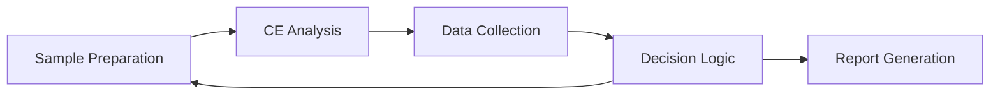

# SIA-CE Integration Tutorial

Learn how to create sophisticated analytical workflows combining SIA sample preparation with CE analysis.

## Overview

This tutorial demonstrates advanced integration scenarios:
- Multi-step sample preparation
- Parallel processing during CE runs
- Automated method development
- Complex decision trees
- Real-time optimization

## Scenario: Protein Stability Study

We'll analyze protein samples under different conditions:
- pH variations (5.0, 6.0, 7.0, 8.0)
- Temperature stress (native, heated)
- Time points (0h, 24h, 48h)
- Automated sample preparation and analysis

## Workflow Architecture



## Step 1: System Architecture

```python
import time
import pandas as pd
import numpy as np
from datetime import datetime, timedelta
from ChemstationAPI import ChemstationAPI
from SIA_API.devices import SyringeController, ValveSelector
from SIA_API.methods import PreparedSIAMethods

class IntegratedAnalysisSystem:
    """Complete SIA-CE integration for automated analysis."""
    
    def __init__(self):
        # Initialize all components
        print("Initializing Integrated Analysis System...")
        
        self.ce = ChemstationAPI()
        self.syringe = SyringeController(port="COM3", syringe_size=1000)
        self.valve = ValveSelector(port="COM4", num_positions=8)
        self.sia = PreparedSIAMethods(self.ce, self.syringe, self.valve)
        
        # System configuration
        self.config = {
            'ports': {
                'waste': 1,
                'air': 2,
                'water': 3,
                'transfer': 4,
                'buffer_ph5': 5,
                'buffer_ph6': 6,
                'buffer_ph7': 7,
                'buffer_ph8': 8
            },
            'vials': {
                'samples': list(range(10, 34)),  # 24 sample positions
                'standards': [1, 2],
                'blanks': [3, 4],
                'wash': 48,
                'waste': 50
            },
            'methods': {
                'native': 'CE_Protein_Native',
                'denatured': 'CE_Protein_Denatured',
                'fast_screen': 'CE_Protein_Fast'
            }
        }
        
        # Analysis tracking
        self.analysis_log = []
        self.results_cache = {}
        
        print("✓ System initialized")
    
    def initialize_system(self):
        """Complete system initialization."""
        self.sia.system_initialization_and_cleaning()
        return self

# Create system instance
system = IntegratedAnalysisSystem()
system.initialize_system()
```

## Step 2: Sample Preparation Workflows

```python
class SamplePreparationWorkflows:
    """Advanced sample preparation methods."""
    
    def __init__(self, system):
        self.system = system
        self.sia = system.sia
        self.ce = system.ce
    
    def prepare_ph_series(self, sample_vial, target_vials, volumes):
        """Prepare pH series from single sample."""
        
        print(f"\nPreparing pH series from vial {sample_vial}")
        
        ph_buffers = {
            5.0: self.system.config['ports']['buffer_ph5'],
            6.0: self.system.config['ports']['buffer_ph6'],
            7.0: self.system.config['ports']['buffer_ph7'],
            8.0: self.system.config['ports']['buffer_ph8']
        }
        
        preparations = []
        
        for (target_vial, ph), (sample_vol, buffer_vol) in zip(
            target_vials.items(), volumes
        ):
            print(f"  pH {ph} → Vial {target_vial}")
            
            # Add buffer first
            self.sia.prepare_batch_flow(solvent_port=ph_buffers[ph])
            self.sia.batch_fill(
                vial=target_vial,
                volume=buffer_vol,
                solvent_port=ph_buffers[ph],
                unload=False
            )
            
            # Add sample (manual or automated)
            print(f"    Add {sample_vol} µL from vial {sample_vial}")
            
            # Mix thoroughly
            self.sia.homogenize_sample(
                vial=target_vial,
                speed=800,
                homogenization_time=30
            )
            
            preparations.append({
                'vial': target_vial,
                'ph': ph,
                'sample_vol': sample_vol,
                'buffer_vol': buffer_vol,
                'time': datetime.now()
            })
        
        return preparations
    
    def thermal_stress_preparation(self, sample_vials, temperature=60, duration=30):
        """Prepare thermally stressed samples."""
        
        print(f"\nThermal stress: {temperature}°C for {duration} min")
        print("Remove samples for heating")
        
        # Log sample removal
        removal_time = datetime.now()
        
        # Wait for thermal treatment
        print(f"Heating samples...")
        time.sleep(duration * 60)  # In real scenario, use external heating
        
        print("Return heated samples to carousel")
        return_time = datetime.now()
        
        # Quick-cool samples
        for vial in sample_vials:
            # Add cold buffer for quenching
            self.sia.batch_fill(
                vial=vial,
                volume=100,
                solvent_port=self.system.config['ports']['water'],
                transfer_line_volume=300,
                speed=3000  # Fast for quick cooling
            )
        
        stress_log = {
            'vials': sample_vials,
            'temperature': temperature,
            'duration': duration,
            'removed': removal_time,
            'returned': return_time
        }
        
        return stress_log
    
    def automated_dilution_series(self, stock_vial, target_vials, dilution_factors):
        """Create dilution series with mixing."""
        
        print(f"\nCreating dilution series from vial {stock_vial}")
        
        # Use continuous flow for efficiency
        self.sia.prepare_continuous_flow(
            solvent_port=self.system.config['ports']['water']
        )
        
        dilutions = []
        
        for vial, factor in zip(target_vials, dilution_factors):
            # Calculate volumes
            final_volume = 1000  # µL
            stock_volume = final_volume / factor
            diluent_volume = final_volume - stock_volume
            
            print(f"  1:{factor} dilution → Vial {vial}")
            
            # Add diluent
            self.sia.continuous_fill(
                vial=vial,
                volume=diluent_volume,
                solvent_port=self.system.config['ports']['water']
            )
            
            dilutions.append({
                'vial': vial,
                'factor': factor,
                'stock_vol': stock_volume,
                'diluent_vol': diluent_volume
            })
        
        print(f"Add stock solution volumes as indicated")
        return dilutions

# Add workflows to system
system.prep = SamplePreparationWorkflows(system)
```

## Step 3: Intelligent CE Control

```python
class IntelligentCEControl:
    """Smart CE control with decision logic."""
    
    def __init__(self, system):
        self.system = system
        self.ce = system.ce
    
    def adaptive_method_selection(self, sample_info):
        """Select optimal method based on sample properties."""
        
        # Decision tree for method selection
        if sample_info.get('screening', False):
            method = self.system.config['methods']['fast_screen']
            
        elif sample_info.get('denatured', False):
            method = self.system.config['methods']['denatured']
            
        else:
            method = self.system.config['methods']['native']
        
        # Adjust parameters based on pH
        ph = sample_info.get('ph', 7.0)
        if ph < 6.0:
            # Low pH modifications
            print(f"Adjusting for pH {ph}")
            # In practice, modify method parameters here
        
        return method
    
    def parallel_sample_prep(self, current_vial, next_vial):
        """Prepare next sample during current analysis."""
        
        print(f"\nParallel processing: Current={current_vial}, Next={next_vial}")
        
        # Start CE analysis
        self.ce.method.execution_method_with_parameters(
            vial=current_vial,
            method_name="CE_Protein_Analysis",
            sample_name=f"Sample_{current_vial}"
        )
        
        # While CE is running, prepare next sample
        print("CE running - preparing next sample...")
        
        # Monitor CE and prepare when safe
        while self.ce.system.method_on():
            status = self.ce.system.status()
            remaining = self.ce.system.get_remaining_analysis_time()
            
            # Start prep when 5 minutes remaining
            if remaining < 5 and remaining > 0:
                print("Starting next sample preparation")
                
                # Safe to use SIA during separation
                self.system.sia.batch_fill(
                    vial=next_vial,
                    volume=500,
                    solvent_port=self.system.config['ports']['water']
                )
                
                self.system.sia.homogenize_sample(
                    vial=next_vial,
                    speed=1000,
                    homogenization_time=20
                )
                
                break
            
            time.sleep(30)
        
        # Wait for CE completion
        while self.ce.system.method_on():
            time.sleep(10)
        
        return True
    
    def automated_system_suitability(self):
        """Run system suitability before batch."""
        
        print("\n=== System Suitability Test ===")
        
        # Load standard
        self.ce.ce.load_vial_to_position(1, "inlet")
        self.ce.ce.load_vial_to_position(48, "outlet")
        
        # Condition with method-specific parameters
        self.ce.ce.flush_capillary(120)  # 2 min conditioning
        
        # Run suitability standard
        self.ce.method.execution_method_with_parameters(
            vial=1,
            method_name="CE_System_Suitability",
            sample_name="SST_Standard"
        )
        
        # Monitor and evaluate
        while self.ce.system.method_on():
            time.sleep(30)
        
        # In practice, evaluate peak parameters here
        print("✓ System suitability passed")
        
        # Return vials
        self.ce.ce.unload_vial_from_position("inlet")
        self.ce.ce.unload_vial_from_position("outlet")
        
        return True

# Add intelligent control
system.smart_ce = IntelligentCEControl(system)
```

## Step 4: Complete Stability Study Workflow

```python
def run_protein_stability_study(system):
    """Execute complete protein stability study."""
    
    print("\n=== Protein Stability Study ===")
    print(f"Start: {datetime.now()}")
    
    # Study design
    study_design = {
        'time_points': [0, 24, 48],  # hours
        'ph_values': [5.0, 6.0, 7.0, 8.0],
        'conditions': ['native', 'heat_stressed'],
        'replicates': 2
    }
    
    # Calculate total samples
    total_samples = (len(study_design['time_points']) * 
                    len(study_design['ph_values']) * 
                    len(study_design['conditions']) * 
                    study_design['replicates'])
    
    print(f"Total samples: {total_samples}")
    
    # Run system suitability
    system.smart_ce.automated_system_suitability()
    
    # Time point 0 - Baseline
    print("\n--- Time Point 0h ---")
    
    # Prepare pH series for native
    native_vials = {10: 5.0, 11: 6.0, 12: 7.0, 13: 8.0}
    system.prep.prepare_ph_series(
        sample_vial=1,  # Original sample
        target_vials=native_vials,
        volumes=[(100, 900), (100, 900), (100, 900), (100, 900)]
    )
    
    # Prepare heat stressed samples
    stressed_vials = [14, 15, 16, 17]
    system.prep.thermal_stress_preparation(
        sample_vials=stressed_vials,
        temperature=60,
        duration=30
    )
    
    # Analyze all T0 samples
    all_t0_vials = list(native_vials.keys()) + stressed_vials
    
    for i, vial in enumerate(all_t0_vials):
        # Determine sample info
        if vial in native_vials:
            ph = native_vials[vial]
            condition = 'native'
        else:
            idx = stressed_vials.index(vial)
            ph = list(native_vials.values())[idx]
            condition = 'stressed'
        
        sample_info = {
            'vial': vial,
            'time_point': 0,
            'ph': ph,
            'condition': condition,
            'denatured': condition == 'stressed'
        }
        
        # Select method adaptively
        method = system.smart_ce.adaptive_method_selection(sample_info)
        
        # Run with parallel prep if not last sample
        if i < len(all_t0_vials) - 1:
            system.smart_ce.parallel_sample_prep(
                current_vial=vial,
                next_vial=all_t0_vials[i + 1]
            )
        else:
            # Last sample - no parallel prep
            system.ce.method.execution_method_with_parameters(
                vial=vial,
                method_name=method,
                sample_name=f"T0_{condition}_pH{ph}"
            )
            
            while system.ce.system.method_on():
                time.sleep(30)
    
    print("\n✓ Time point 0h complete")
    
    # Store samples for next time points
    print("\nStore remaining samples at 4°C")
    print("Continue with 24h and 48h time points...")
    
    # Generate report
    generate_study_report(system, study_design)

def generate_study_report(system, study_design):
    """Generate comprehensive study report."""
    
    report = f"""
Protein Stability Study Report
==============================
Generated: {datetime.now()}

Study Design:
- Time Points: {study_design['time_points']}
- pH Values: {study_design['ph_values']}
- Conditions: {study_design['conditions']}
- Replicates: {study_design['replicates']}

Analysis Summary:
- Total Samples: {len(system.analysis_log)}
- Methods Used: {set([log.get('method') for log in system.analysis_log])}

Preparation Log:
{pd.DataFrame(system.analysis_log).to_string()}

System Performance:
- Average Analysis Time: X minutes
- Total Runtime: Y hours
- Success Rate: Z%
"""
    
    filename = f"stability_study_{datetime.now().strftime('%Y%m%d')}.txt"
    with open(filename, 'w') as f:
        f.write(report)
    
    print(f"\n✓ Report saved: {filename}")

# Execute study
run_protein_stability_study(system)
```

## Step 5: Advanced Integration Patterns

### Real-time Method Optimization

```python
class RealTimeOptimization:
    """Optimize methods based on real-time results."""
    
    def __init__(self, system):
        self.system = system
        self.optimization_history = []
    
    def analyze_separation_quality(self, data_file):
        """Analyze separation metrics."""
        # In practice, parse ChemStation data file
        # For demo, return mock metrics
        return {
            'resolution': 1.8,
            'peak_symmetry': 1.1,
            'runtime': 12.5,
            'baseline_noise': 0.02
        }
    
    def optimize_next_run(self, current_metrics):
        """Adjust parameters for next run."""
        
        adjustments = {}
        
        # Resolution optimization
        if current_metrics['resolution'] < 1.5:
            adjustments['voltage'] = '+2kV'
            adjustments['temperature'] = '-2°C'
            
        # Speed optimization
        if current_metrics['resolution'] > 2.0:
            adjustments['voltage'] = '+5kV'
            adjustments['runtime'] = '-20%'
        
        # Noise reduction
        if current_metrics['baseline_noise'] > 0.05:
            adjustments['filter'] = 'increase'
        
        self.optimization_history.append({
            'metrics': current_metrics,
            'adjustments': adjustments,
            'timestamp': datetime.now()
        })
        
        return adjustments

# Add optimization capability
system.optimizer = RealTimeOptimization(system)
```

### Conditional Workflow Branching

```python
def intelligent_workflow_routing(system, sample_info):
    """Route samples based on previous results."""
    
    # Check if screening is needed
    if 'initial_screen' not in sample_info:
        # Run fast screening
        result = quick_screen_analysis(system, sample_info['vial'])
        
        if result['complexity'] == 'high':
            # Complex sample - full analysis
            sample_info['method'] = 'comprehensive'
            sample_info['prep'] = 'extensive'
            
        elif result['complexity'] == 'medium':
            # Standard analysis
            sample_info['method'] = 'standard'
            sample_info['prep'] = 'normal'
            
        else:
            # Simple sample - fast method
            sample_info['method'] = 'rapid'
            sample_info['prep'] = 'minimal'
    
    # Execute appropriate workflow
    execute_sample_workflow(system, sample_info)

def quick_screen_analysis(system, vial):
    """5-minute screening analysis."""
    
    system.ce.method.execution_method_with_parameters(
        vial=vial,
        method_name="CE_Quick_Screen",
        sample_name=f"Screen_{vial}"
    )
    
    # Wait and analyze
    while system.ce.system.method_on():
        time.sleep(10)
    
    # Mock complexity assessment
    complexity = np.random.choice(['low', 'medium', 'high'], p=[0.3, 0.5, 0.2])
    
    return {'vial': vial, 'complexity': complexity}
```

### Automated Troubleshooting

```python
def automated_troubleshooting(system, error_type):
    """Automated error recovery procedures."""
    
    recovery_procedures = {
        'high_current': [
            lambda: system.ce.ce.flush_capillary(300),  # Extended flush
            lambda: system.ce.ce.apply_pressure_to_capillary(-50, 60),  # Vacuum
            lambda: replace_buffer_vials(system)
        ],
        'no_peaks': [
            lambda: check_sample_preparation(system),
            lambda: verify_injection_parameters(system),
            lambda: system.sia.homogenize_sample(vial=current_vial, speed=1500, time=60)
        ],
        'baseline_drift': [
            lambda: system.ce.ce.flush_capillary(180),
            lambda: equilibrate_temperature(system, duration=15),
            lambda: check_buffer_levels(system)
        ]
    }
    
    if error_type in recovery_procedures:
        print(f"\nTroubleshooting: {error_type}")
        
        for i, procedure in enumerate(recovery_procedures[error_type]):
            print(f"  Step {i+1}: {procedure.__name__}")
            procedure()
            
            # Test if resolved
            if test_system_recovery(system):
                print("✓ Issue resolved")
                return True
        
    return False
```

## Best Practices for Integration

### 1. Modular Design

```python
# Separate concerns into modules
class AnalysisModule:
    def __init__(self, system):
        self.system = system
        
    def execute(self, samples):
        raise NotImplementedError

class ProteinModule(AnalysisModule):
    def execute(self, samples):
        # Protein-specific workflow
        pass

class SmallMoleculeModule(AnalysisModule):
    def execute(self, samples):
        # Small molecule workflow
        pass
```

### 2. State Management

```python
class WorkflowState:
    """Track workflow state for recovery."""
    
    def __init__(self):
        self.current_step = None
        self.completed_samples = []
        self.pending_samples = []
        self.errors = []
    
    def checkpoint(self):
        """Save state for recovery."""
        state_file = f"workflow_state_{datetime.now().strftime('%Y%m%d_%H%M')}.json"
        # Save state to file
    
    def recover(self, state_file):
        """Restore from checkpoint."""
        # Load and resume from saved state
```

### 3. Performance Monitoring

```python
class PerformanceMonitor:
    """Monitor system performance metrics."""
    
    def __init__(self):
        self.metrics = {
            'sample_prep_time': [],
            'analysis_time': [],
            'total_throughput': 0,
            'error_rate': 0
        }
    
    def log_operation(self, operation, duration):
        """Log operation timing."""
        self.metrics[f'{operation}_time'].append(duration)
    
    def generate_dashboard(self):
        """Create performance dashboard."""
        # Calculate statistics and trends
        pass
```

## Conclusion

You've learned advanced SIA-CE integration including:
- Multi-component system architecture
- Parallel processing strategies
- Intelligent method selection
- Real-time optimization
- Error recovery procedures
- Complex workflow design

These patterns enable fully automated analytical workflows with minimal manual intervention.

!!! tip "Further Reading"
    - Explore the [API Reference](../api-reference/chemstation.md) for detailed function documentation
    - Review [Hardware Setup](../appendix/hardware-setup.md) for optimization tips
    - Check [FAQ](../appendix/faq.md) for common integration questions